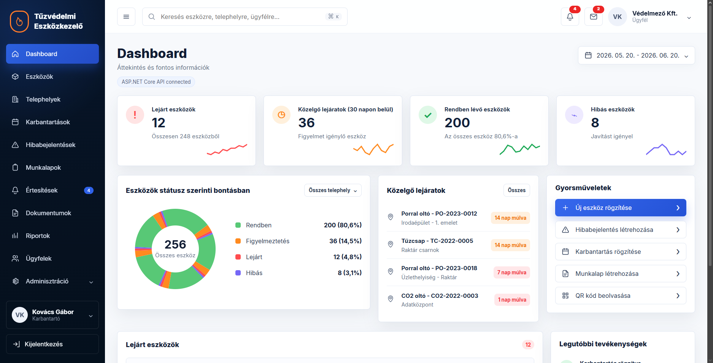

# Fire Safety Equipment Management

A clean, practical platform for organizing fire safety equipment records, tracking maintenance activity, and keeping safety operations visible across teams.

Designed for clarity and reliability, this repository brings the client and server together in one place to support efficient day-to-day safety management.

